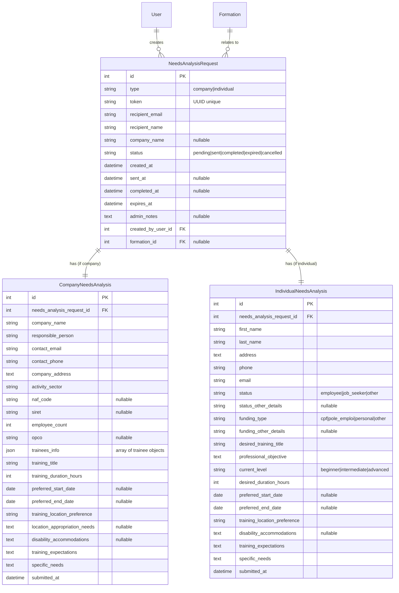
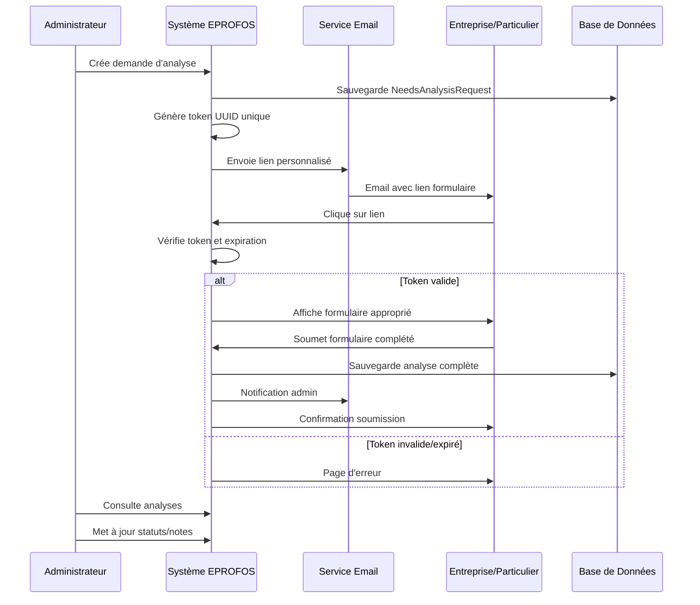
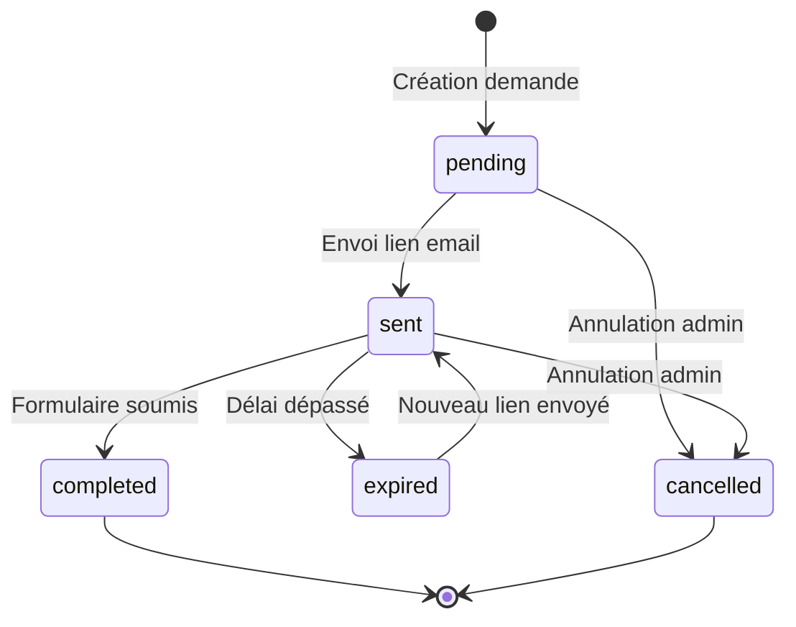

# Architecture du Système d'Analyse des Besoins - Qualiopi 2.4

## Vue d'ensemble

Ce document décrit l'architecture complète du système d'analyse des besoins pour répondre au critère Qualiopi 2.4 : "Le prestataire analyse le besoin du bénéficiaire en lien avec l'entreprise et/ou le financeur concerné(s)."

**Objectif** : Permettre à EPROFOS de collecter et analyser les besoins de formation des entreprises et particuliers via des formulaires sécurisés accessibles par liens temporaires.

**Technologies** : Symfony 7.2, PHP 8.3, PostgreSQL, Bootstrap 5, Stimulus, Docker

## 1. Architecture des Entités

### Diagramme ERD



### Description des Entités

#### NeedsAnalysisRequest
**Entité principale** gérant les demandes d'analyse de besoins
- **Type** : Distingue entreprise/particulier
- **Token** : UUID unique pour sécuriser l'accès
- **Statuts** : Cycle de vie complet de la demande
- **Expiration** : Liens temporaires (30 jours par défaut)
- **Relations** : Créateur admin, formation concernée

#### CompanyNeedsAnalysis
**Analyse spécifique aux entreprises** avec informations complètes
- **Informations légales** : SIRET, NAF, OPCO
- **Stagiaires** : Collection JSON des participants
- **Formation** : Détails du besoin de formation
- **Logistique** : Lieu, accessibilité, besoins spéciaux

#### IndividualNeedsAnalysis
**Analyse spécifique aux particuliers** avec profil détaillé
- **Statut professionnel** : Salarié, demandeur d'emploi, autre
- **Financement** : CPF, Pôle Emploi, fonds propres
- **Objectifs** : Projet professionnel et niveau actuel
- **Préférences** : Dates, lieu, besoins spécifiques

## 2. Architecture des Contrôleurs

### Structure des Contrôleurs

```
src/Controller/
├── Admin/
│   ├── NeedsAnalysisController.php      # Gestion principale admin
│   ├── CompanyAnalysisController.php    # Analyses entreprises
│   └── IndividualAnalysisController.php # Analyses particuliers
└── Public/
    ├── NeedsAnalysisFormController.php  # Point d'entrée formulaires
    ├── CompanyFormController.php        # Formulaire entreprise
    └── IndividualFormController.php     # Formulaire particulier
```

### Responsabilités des Contrôleurs

#### Admin/NeedsAnalysisController
- **CRUD** des demandes d'analyse
- **Création** et envoi de liens sécurisés
- **Gestion** des statuts et notes administratives
- **Export** des données pour audits Qualiopi

#### Public/NeedsAnalysisFormController
- **Validation** des tokens et expiration
- **Routage** vers formulaire approprié
- **Gestion** des erreurs (lien expiré, invalide)

#### Contrôleurs de Formulaires
- **Affichage** des formulaires spécialisés
- **Validation** et sauvegarde des réponses
- **Notifications** de confirmation

## 3. Services Métier

### Structure des Services

```
src/Service/NeedsAnalysis/
├── NeedsAnalysisService.php        # Service principal
├── TokenGeneratorService.php       # Génération tokens sécurisés
├── EmailNotificationService.php    # Envoi emails avec templates
├── FormValidationService.php       # Validation spécialisée
├── ExpirationManagerService.php    # Gestion expiration liens
└── ReportGeneratorService.php      # Génération rapports Qualiopi
```

### Responsabilités des Services

#### NeedsAnalysisService
```php
/**
 * Service principal pour la gestion des analyses de besoins
 */
class NeedsAnalysisService
{
    public function createAnalysisRequest(string $type, array $data): NeedsAnalysisRequest;
    public function sendAnalysisLink(NeedsAnalysisRequest $request): bool;
    public function validateToken(string $token): ?NeedsAnalysisRequest;
    public function completeAnalysis(NeedsAnalysisRequest $request, array $data): void;
    public function updateStatus(NeedsAnalysisRequest $request, string $status): void;
}
```

#### TokenGeneratorService
```php
/**
 * Génération et validation de tokens sécurisés
 */
class TokenGeneratorService
{
    public function generateSecureToken(): string;
    public function isTokenValid(string $token): bool;
    public function isTokenExpired(NeedsAnalysisRequest $request): bool;
}
```

#### EmailNotificationService
```php
/**
 * Gestion des notifications email avec templates
 */
class EmailNotificationService
{
    public function sendAnalysisInvitation(NeedsAnalysisRequest $request): void;
    public function sendCompletionNotification(NeedsAnalysisRequest $request): void;
    public function sendExpirationReminder(NeedsAnalysisRequest $request): void;
}
```

## 4. Workflow du Système

### Diagramme de Séquence



### États et Transitions



## 5. Structure des Formulaires

### Formulaire Entreprise (CompanyNeedsAnalysisType)

#### Sections du formulaire
1. **Informations Entreprise**
   - Nom de l'entreprise
   - Responsable formation
   - Contact (email, téléphone)
   - Adresse complète
   - Secteur d'activité
   - Code NAF (optionnel)
   - SIRET (optionnel)
   - Nombre de salariés
   - OPCO (optionnel)

2. **Informations Stagiaires**
   - Collection dynamique avec :
     - Nom et prénom
     - Fonction dans l'entreprise
   - Boutons ajouter/supprimer stagiaire

3. **Formation Souhaitée**
   - Intitulé de la formation
   - Durée souhaitée (heures)
   - Dates prévisionnelles (début/fin)

4. **Lieu et Logistique**
   - Préférence lieu de formation
   - Besoins d'appropriation des locaux
   - Accommodations handicap

5. **Attentes et Besoins**
   - Attentes de la formation
   - Besoins spécifiques

### Formulaire Particulier (IndividualNeedsAnalysisType)

#### Sections du formulaire
1. **Informations Bénéficiaire**
   - Nom et prénom
   - Adresse complète
   - Téléphone et email

2. **Statut Professionnel**
   - Salarié / Demandeur d'emploi / Autre
   - Précisions si "Autre"

3. **Type de Financement**
   - CPF / Pôle Emploi / Fonds propres / Autre
   - Précisions si "Autre"

4. **Formation Souhaitée**
   - Intitulé de la formation
   - Objectif professionnel
   - Niveau estimé (débutant/intermédiaire/avancé)
   - Durée souhaitée (heures)
   - Dates préférentielles

5. **Lieu et Logistique**
   - Préférence lieu de formation
   - Accommodations handicap

6. **Attentes et Besoins**
   - Attentes de la formation
   - Besoins spécifiques

## 6. Interface Admin

### Pages Principales

```
/admin/needs-analysis/
├── index                    # Liste avec filtres et statistiques
├── create                   # Création nouvelle demande
├── {id}/show               # Détail demande avec actions
├── {id}/edit               # Modification statut/notes
├── {id}/resend             # Renvoyer nouveau lien
├── company/{id}/show       # Détail analyse entreprise
├── individual/{id}/show    # Détail analyse particulier
└── export                  # Export CSV/PDF
```

### Fonctionnalités Admin

#### Dashboard Principal
- **Statistiques** : En attente, envoyées, complétées, expirées
- **Graphiques** : Évolution dans le temps, répartition par type
- **Actions rapides** : Créer nouvelle demande, voir en attente

#### Liste des Demandes
- **Filtres** : Type, statut, date création, formation
- **Recherche** : Nom, email, entreprise
- **Tri** : Date, statut, type
- **Actions en lot** : Suppression, changement statut
- **Pagination** : Navigation efficace

#### Détail d'une Demande
- **Informations** : Détails complets de la demande
- **Historique** : Création, envoi, complétion
- **Actions** : Modifier statut, ajouter notes, renvoyer lien
- **Analyse** : Lien vers l'analyse complétée

#### Gestion des Analyses
- **Lecture seule** : Réponses du client non modifiables
- **Notes admin** : Section administrative modifiable
- **Export** : PDF pour archivage, CSV pour traitement
- **Statuts** : Workflow de suivi (en attente → en cours → analysé → terminé)

## 7. Templates et Interface Utilisateur

### Structure des Templates

```
templates/
├── admin/needs_analysis/
│   ├── index.html.twig              # Liste des demandes
│   ├── create.html.twig             # Création demande
│   ├── show.html.twig               # Détail demande
│   ├── edit.html.twig               # Modification
│   ├── company/
│   │   └── show.html.twig           # Analyse entreprise
│   ├── individual/
│   │   └── show.html.twig           # Analyse particulier
│   └── components/
│       ├── statistics_cards.html.twig
│       ├── filters.html.twig
│       └── actions_dropdown.html.twig
├── public/needs_analysis/
│   ├── company_form.html.twig       # Formulaire entreprise
│   ├── individual_form.html.twig    # Formulaire particulier
│   ├── expired.html.twig            # Lien expiré
│   ├── completed.html.twig          # Déjà complété
│   └── error.html.twig              # Erreur générale
└── emails/needs_analysis/
    ├── company_invitation.html.twig  # Invitation entreprise
    ├── individual_invitation.html.twig # Invitation particulier
    ├── completion_notification.html.twig # Notification admin
    └── reminder.html.twig            # Rappel expiration
```

### Composants Bootstrap 5

#### Cards Statistiques
```html
<div class="row">
    <div class="col-md-3">
        <div class="card bg-primary text-white">
            <div class="card-body">
                <h5>En attente</h5>
                <h2>{{ stats.pending }}</h2>
            </div>
        </div>
    </div>
    <!-- Autres statistiques -->
</div>
```

#### Formulaires Dynamiques
- **Collection Symfony** pour les stagiaires
- **JavaScript Stimulus** pour ajouter/supprimer
- **Validation temps réel** avec feedback Bootstrap
- **Progress bar** pour les sections multiples

## 8. Sécurité et Validation

### Mesures de Sécurité

#### Tokens et Accès
- **UUID v4** : Tokens non-prédictibles
- **Expiration** : 30 jours par défaut, configurable
- **Usage unique** : Token invalidé après soumission
- **Vérification** : Token + expiration à chaque accès

#### Protection des Formulaires
- **CSRF Protection** : Tokens sur tous les formulaires
- **Rate Limiting** : Limitation tentatives par IP
- **Validation stricte** : Contraintes Symfony + JavaScript
- **Sanitisation** : Nettoyage des données d'entrée

#### Logging et Audit
```php
// Exemples de logs
$this->logger->info('Needs analysis request created', [
    'request_id' => $request->getId(),
    'type' => $request->getType(),
    'created_by' => $user->getId()
]);

$this->logger->warning('Invalid token access attempt', [
    'token' => $token,
    'ip' => $request->getClientIp()
]);
```

### Validation des Données

#### Contraintes Entités
```php
class CompanyNeedsAnalysis
{
    #[Assert\NotBlank(message: 'Le nom de l\'entreprise est obligatoire')]
    #[Assert\Length(max: 255)]
    private ?string $companyName = null;

    #[Assert\Email(message: 'Email invalide')]
    private ?string $contactEmail = null;

    #[Assert\Regex(
        pattern: '/^\d{14}$/',
        message: 'Le SIRET doit contenir 14 chiffres'
    )]
    private ?string $siret = null;
}
```

#### Validation JavaScript
- **Validation temps réel** avec Stimulus
- **Messages d'erreur** localisés
- **Indicateurs visuels** Bootstrap
- **Prévention soumission** si erreurs

## 9. Intégration avec l'Existant

### Relations avec les Entités Existantes

#### User (Administrateurs)
- **Créateur** : Qui a créé la demande d'analyse
- **Traçabilité** : Historique des actions admin
- **Permissions** : Accès selon rôles

#### Formation (Optionnel)
- **Contexte** : Formation concernée par l'analyse
- **Statistiques** : Analyses par formation
- **Recommandations** : Formations suggérées

#### ContactRequest (Évolution)
- **Migration** : Transformer demandes contact en analyses
- **Historique** : Lien entre contact initial et analyse
- **Workflow** : Contact → Analyse → Formation

### Réutilisation des Composants

#### Services Existants
- **EmailService** : Notifications et invitations
- **LoggerService** : Traçabilité des actions
- **ValidationService** : Règles métier communes

#### Templates et UI
- **Base admin** : Layout et navigation cohérents
- **Composants Bootstrap** : Cards, formulaires, modales
- **Stimulus controllers** : Interactions JavaScript

## 10. Plan d'Implémentation

### Phase 1 : Fondations (Sprint 1-2)
1. **Entités** : Création des 3 entités principales
2. **Migrations** : Base de données
3. **Repositories** : Requêtes de base
4. **Services core** : TokenGenerator, NeedsAnalysisService

### Phase 2 : Interface Admin (Sprint 3-4)
1. **Contrôleurs admin** : CRUD complet
2. **Templates admin** : Liste, création, détail
3. **Formulaires** : Types Symfony pour admin
4. **Tests** : Unitaires et fonctionnels

### Phase 3 : Formulaires Publics (Sprint 5-6)
1. **Contrôleurs publics** : Gestion tokens et formulaires
2. **Templates publics** : Formulaires entreprise/particulier
3. **Validation** : Contraintes et JavaScript
4. **Tests** : Parcours complets

### Phase 4 : Notifications et Finitions (Sprint 7-8)
1. **EmailService** : Templates et envois
2. **Gestion expiration** : Commandes et rappels
3. **Export** : CSV et PDF
4. **Documentation** : Utilisateur et technique

### Estimation Globale
- **Durée** : 8 sprints (16 semaines)
- **Complexité** : Moyenne-élevée
- **Risques** : Validation métier, intégration email

## 11. Tests et Qualité

### Stratégie de Tests

#### Tests Unitaires
- **Services** : Logique métier isolée
- **Validators** : Règles de validation
- **Utilities** : Fonctions utilitaires

#### Tests Fonctionnels
- **Contrôleurs** : Réponses HTTP et redirections
- **Formulaires** : Soumission et validation
- **Workflow** : Parcours complets utilisateur

#### Tests d'Intégration
- **Base de données** : Persistance et relations
- **Email** : Envoi et templates
- **Sécurité** : Tokens et accès

### Métriques Qualité
- **Couverture** : >80% pour les services
- **PSR** : Respect des standards PHP
- **Documentation** : PHPDoc obligatoire
- **Performance** : Temps de réponse <500ms

## 12. Évolutions Futures

### Fonctionnalités Avancées

#### Automatisation
- **Rappels automatiques** : Avant expiration
- **Relances** : Si pas de réponse
- **Archivage** : Anciennes analyses
- **Rapports** : Génération automatique

#### Intégrations
- **API REST** : Accès externe aux données
- **Webhooks** : Notifications temps réel
- **CRM** : Synchronisation contacts
- **Calendrier** : Planification formations

#### Analytics
- **Dashboard** : Métriques Qualiopi
- **Tendances** : Évolution des besoins
- **Prédictions** : IA pour recommandations
- **Exports** : Formats multiples

### Optimisations Techniques

#### Performance
- **Cache** : Formulaires et templates
- **Indexation** : Base de données
- **CDN** : Assets statiques
- **Compression** : Réponses HTTP

#### Scalabilité
- **Queue** : Traitement asynchrone emails
- **Microservices** : Séparation des responsabilités
- **Load balancing** : Répartition de charge
- **Monitoring** : Surveillance système

---

## Conclusion

Cette architecture fournit une base solide et extensible pour le système d'analyse des besoins EPROFOS, répondant précisément aux exigences du critère Qualiopi 2.4 tout en s'intégrant harmonieusement avec l'infrastructure existante.

**Points clés** :
- ✅ Conformité Qualiopi 2.4
- ✅ Sécurité et traçabilité
- ✅ Interface admin complète
- ✅ Formulaires spécialisés
- ✅ Intégration existant
- ✅ Évolutivité future

**Prochaines étapes** : Basculer en mode Code pour l'implémentation selon le plan défini.