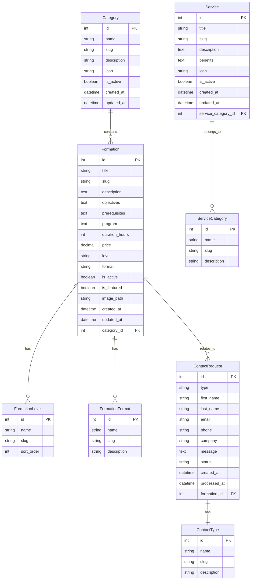
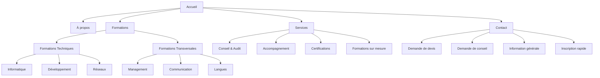

# Architecture du Site Public EPROFOS

## Vue d'ensemble

Ce document décrit l'architecture complète de la partie publique du site EPROFOS (École professionnelle de formation spécialisée), une plateforme d'e-learning et de vente de formations.

**Technologies utilisées :**
- Symfony 7.3, PHP 8.3, PostgreSQL
- Docker pour le développement et déploiement
- Bootstrap 5, Stimulus, Hotwire Turbo
- Asset Mapper pour les assets statiques

## 1. Structure des Pages Publiques

### Pages principales
- **Accueil** (`/`) - Présentation générale, formations phares, services
- **À propos** (`/about`) - Présentation d'EPROFOS, équipe, valeurs
- **Formations** (`/formations`) - Catalogue complet avec filtres
- **Formation détail** (`/formations/{slug}`) - Page détaillée d'une formation
- **Services** (`/services`) - Présentation des services (conseil, audit, etc.)
- **Contact** (`/contact`) - Informations de contact et formulaires
- **Mentions légales** (`/legal`) - Mentions légales et CGV

### Types de formations
- **Formations techniques** : Informatique, Développement, Réseaux
- **Formations transversales** : Management, Communication, Langues
- **Niveaux** : Débutant, Intermédiaire, Avancé

### Services proposés
- Conseil et audit de besoins en formation
- Accompagnement personnalisé
- Certifications professionnelles
- Formations sur mesure en entreprise

## 2. Architecture des Entités Doctrine



### Description des entités principales

#### Category
Catégories de formations (Techniques, Transversales)
- Gestion des icônes et descriptions
- Système d'activation/désactivation
- Slug pour URLs SEO-friendly

#### Formation
Entité centrale représentant une formation
- Informations complètes (objectifs, prérequis, programme)
- Gestion des prix et durées
- Système de mise en avant (featured)
- Relations avec catégories et niveaux

#### Service
Services proposés par EPROFOS
- Description détaillée et bénéfices
- Catégorisation des services
- Gestion des icônes

#### ContactRequest
Demandes de contact avec types spécialisés
- Formulaires différenciés (devis, conseil, info, inscription)
- Suivi du statut de traitement
- Relation optionnelle avec formations

## 3. Organisation des Contrôleurs

### Structure des contrôleurs
```
src/Controller/Public/
├── HomeController.php              # Page d'accueil
├── AboutController.php             # Page à propos
├── FormationController.php         # Catalogue et détail formations
├── ServiceController.php           # Services EPROFOS
├── ContactController.php           # Contact et formulaires
└── LegalController.php             # Mentions légales
```

### Responsabilités des contrôleurs
- **HomeController** : Affichage formations phares, services principaux
- **FormationController** : Catalogue avec filtres, pagination, détail formation
- **ServiceController** : Présentation des services par catégorie
- **ContactController** : Gestion des 4 types de formulaires
- **AboutController** : Contenu statique de présentation
- **LegalController** : Mentions légales et CGV

## 4. Services Métier

### Structure des services
```
src/Service/
├── Formation/
│   ├── FormationService.php        # Logique métier formations
│   ├── FormationSearchService.php  # Recherche et filtres
│   └── FormationCatalogService.php # Gestion catalogue
├── Contact/
│   ├── ContactRequestService.php   # Gestion demandes contact
│   ├── AnalysisEmailNotificationService.php # Notifications email
│   └── FormValidationService.php   # Validation formulaires
└── Content/
    ├── ContentService.php          # Gestion contenu statique
    └── SeoService.php              # Optimisation SEO
```

### Responsabilités des services
- **Séparation des préoccupations** : Business logic hors des contrôleurs
- **Réutilisabilité** : Services utilisables dans différents contextes
- **Testabilité** : Logique métier facilement testable
- **Extensibilité** : Préparation pour l'interface d'administration

## 5. Structure des Templates avec Bootstrap 5

```
templates/
├── base.html.twig                  # Template de base
├── components/                     # Composants réutilisables
│   ├── navbar.html.twig
│   ├── footer.html.twig
│   ├── breadcrumb.html.twig
│   ├── formation_card.html.twig
│   ├── service_card.html.twig
│   └── contact_form.html.twig
├── public/                         # Templates pages publiques
│   ├── home/
│   │   └── index.html.twig
│   ├── about/
│   │   └── index.html.twig
│   ├── formation/
│   │   ├── index.html.twig         # Catalogue
│   │   ├── show.html.twig          # Détail formation
│   │   └── _filters.html.twig      # Filtres de recherche
│   ├── service/
│   │   └── index.html.twig
│   ├── contact/
│   │   ├── index.html.twig
│   │   ├── _quote_form.html.twig   # Formulaire devis
│   │   ├── _consultation_form.html.twig # Formulaire conseil
│   │   ├── _info_form.html.twig    # Formulaire info
│   │   └── _quick_registration.html.twig # Inscription rapide
│   └── legal/
│       └── index.html.twig
└── emails/                         # Templates emails
    ├── contact_request.html.twig
    ├── quote_request.html.twig
    └── consultation_request.html.twig
```

### Principes de templating
- **Composants réutilisables** : Cards, formulaires, navigation
- **Bootstrap 5** : Utilisation complète du framework CSS
- **Responsive design** : Adaptation mobile-first
- **Accessibilité** : Respect des standards WCAG

## 6. Organisation des Assets

```
assets/
├── app.js                          # Point d'entrée principal
├── bootstrap.js                    # Configuration Stimulus
├── styles/
│   ├── app.css                     # Styles principaux
│   ├── components/                 # Styles composants
│   │   ├── navbar.css
│   │   ├── footer.css
│   │   ├── cards.css
│   │   └── forms.css
│   └── pages/                      # Styles spécifiques pages
│       ├── home.css
│       ├── formations.css
│       └── contact.css
├── controllers/                    # Contrôleurs Stimulus
│   ├── formation_filter_controller.js # Filtres formations
│   ├── contact_form_controller.js     # Formulaires contact
│   ├── navbar_controller.js           # Navigation responsive
│   └── scroll_controller.js           # Effets de scroll
└── images/                         # Images statiques
    ├── logo/
    ├── formations/
    └── services/
```

### Contrôleurs Stimulus
- **formation_filter_controller.js** : Filtrage Ajax du catalogue
- **contact_form_controller.js** : Validation et soumission formulaires
- **navbar_controller.js** : Menu responsive et navigation
- **scroll_controller.js** : Animations et effets de scroll

## 7. Structure de Navigation



## 8. Fonctionnalités Clés

### Catalogue de formations
- **Filtrage avancé** : Catégorie, niveau, format, durée, prix
- **Recherche textuelle** : Dans titre et description
- **Tri multiple** : Pertinence, prix, durée, date
- **Pagination Ajax** : Chargement sans rechargement de page
- **Vues multiples** : Grille et liste

### Système de formulaires
- **4 types de formulaires** spécialisés
- **Validation** côté client (Stimulus) et serveur (Symfony)
- **Protection CSRF** intégrée
- **Notifications email** automatiques
- **Sauvegarde** en base de données
- **Interface admin** pour traitement (future)

### SEO et Performance
- **URLs optimisées** avec slugs SEO-friendly
- **Meta tags dynamiques** par page
- **Schema.org** pour formations (structured data)
- **Sitemap XML** automatique
- **Cache Symfony** pour optimisation performances

## 9. Sécurité et Validation

### Mesures de sécurité
- **Protection CSRF** sur tous les formulaires
- **Validation** stricte des données d'entrée
- **Sanitisation** des contenus utilisateur
- **Rate limiting** sur les formulaires de contact

### Validation des données
- **Contraintes Symfony** sur les entités
- **Validation JavaScript** pour UX
- **Messages d'erreur** localisés
- **Logging** des tentatives malveillantes

## 10. Extensibilité Future

### Préparation pour l'administration
- **Entités** prêtes pour CRUD admin
- **Services métier** réutilisables
- **Séparation** claire public/admin
- **API REST** potentielle

### Évolutions possibles
- **Système de réservation** en ligne
- **Paiement** intégré (Stripe, PayPal)
- **Espace client** avec suivi formations
- **Blog** et actualités
- **Témoignages** clients
- **Newsletter** et marketing automation
- **Système de notation** des formations

## 11. Standards de Développement

### Bonnes pratiques Symfony
- **Séparation des responsabilités** stricte
- **Services** pour la logique métier
- **Repositories** pour les requêtes complexes
- **Events** pour les actions transversales

### Documentation et Qualité
- **PHPDoc** obligatoire sur toutes les classes
- **Tests unitaires** pour les services
- **Tests fonctionnels** pour les contrôleurs
- **Standards PSR** respectés

### Performance
- **Cache** Symfony pour les données statiques
- **Optimisation** des requêtes Doctrine
- **Lazy loading** des relations
- **CDN** pour les assets (production)

---

Cette architecture assure une base solide, maintenable et extensible pour le site public d'EPROFOS, en respectant les meilleures pratiques Symfony et en préparant les évolutions futures.